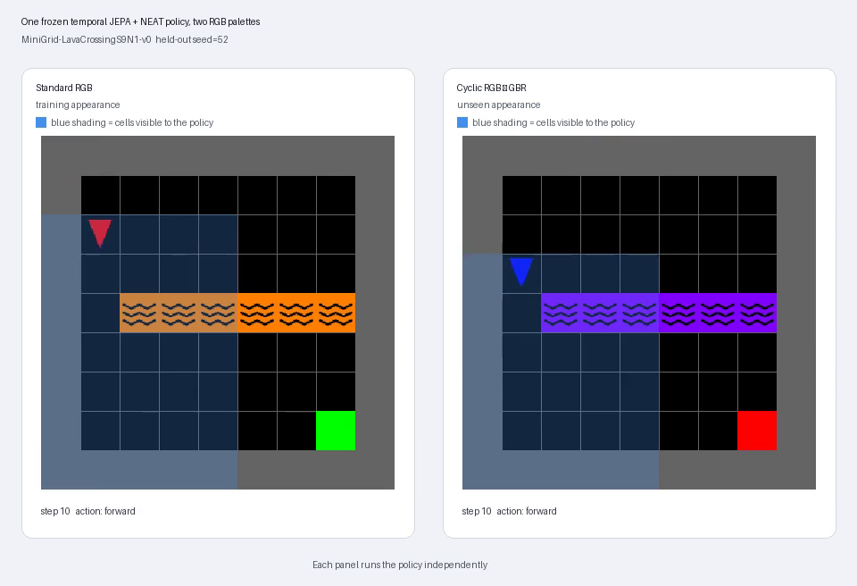
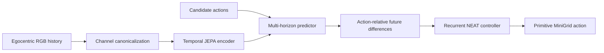

# Zima Blue: JEPA + Neuroevolution

Can a small predictive world model provide useful visual state to an evolved controller—without an LLM choosing actions or a hand-authored map?

[](artifacts/jepa/temporal-jepa-color-success-full-grid-seed52.mp4)

**Click the preview to watch two independent policy runs on the same held-out layout under normal and shifted colours.** Blue shading marks the cells visible to the agent; the rest of the grid is shown only for the viewer.

## What this project demonstrates

Zima Blue trains a temporal Joint-Embedding Predictive Architecture (JEPA) on egocentric MiniGrid observations, freezes the learned representation, and evolves recurrent NEAT controllers over its latent state.

The strongest matched Dynamic Obstacles experiment uses action-relative counterfactual features and only 103 controller inputs. Across three evolution seeds, trained JEPA features average **35% held-out success**, compared with **10%** for matched randomized predictors. Each trained run reaches 7/20, while random controls vary from 0/20 to 6/20.

This is evidence that the learned dynamics are useful to the evolved controller—not a claim that the approach has solved general navigation. Controller-search variance and long-horizon partial observability remain open problems.

## Architecture



The JEPA predicts future latent states at multiple horizons. It does not receive rewards, routes, goal coordinates, or hidden simulator state. NEAT evolves the controller while the world model stays frozen during each evaluation block.

## Selected findings

| Experiment | Result |
|---|---:|
| Repaired JEPA future-branch retrieval, horizons 1 / 2 / 4 | 95.8% / 75.8% / 66.7% |
| Action-relative trained JEPA, three evolution seeds | 7/20 each |
| Action-relative randomized predictors | 0/20, 0/20, 6/20 |
| Best graph-mode controller on untouched layouts | 6/40 |
| Full-state next-safe-action diagnostic oracle | 20/20 |

The oracle is intentionally strong and diagnostic only: it shows that route-relevant state, rather than motor capacity, is the central bottleneck.

## Reproduce the core experiment

Requires Python 3.11+ and [`uv`](https://docs.astral.sh/uv/).

```bash
uv sync

uv run zima-temporal-rgb-jepa-train \
  --env MiniGrid-LavaCrossingS9N1-v0 \
  --episodes 300 --expert-episodes 80 --updates 3000 \
  --checkpoint artifacts/jepa/temporal-rgb-s9n1-improved.pt

uv run zima-rgb-neat \
  --checkpoint artifacts/jepa/temporal-rgb-s9n1-improved.pt \
  --seed 19 --generations 20 --population 30

uv run zima-rgb-color-video
```

On Windows PowerShell, place multiline commands on one line or replace each trailing `\` with a backtick.

Run the test suite:

```bash
uv run pytest -q
```

## Repository guide

- [`zima_py/`](zima_py/) — training, evaluation, evolution, belief, evidence-map, and rollout modules.
- [`artifacts/jepa/`](artifacts/jepa/) — compact reproducible checkpoints, reports, and demonstrations.
- [`docs/temporal-jepa-neuroevolution-report.md`](docs/temporal-jepa-neuroevolution-report.md) — temporal JEPA experiments and analysis.
- [`docs/counterfactual-jepa-neuroevolution.md`](docs/counterfactual-jepa-neuroevolution.md) — counterfactual and graph-mode work.
- [`docs/research-history.md`](docs/research-history.md) — full chronological experiment diary and legacy harness documentation.

## Scope

This is an experimental research repository. Results are reported with their matched controls and failure modes so improvements remain falsifiable and reproducible.
