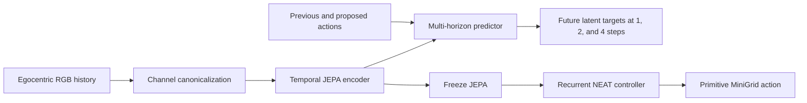

# Zima Blue: JEPA + Neuroevolution

Can a small predictive world model provide useful visual state to an evolved
controller—without an LLM choosing actions or a hand-authored map?

This repository explores that question in partially observed MiniGrid. A temporal
JEPA learns compact predictive representations from egocentric RGB observations.
The JEPA is then frozen, and recurrent NEAT evolves a primitive-action controller
on top of its latent state.

## Current Result

The improved pretraining run combines random exploration with 80 successful
trajectories and predicts 1, 2, and 4 steps into the future. Per-pixel RGB channel
canonicalization makes the representation invariant to permutations of the three
colour channels while preserving spatial structure.

| Frozen representation | Training layouts | Normal-colour holdout | Shifted-colour holdout |
|---|---:|---:|---:|
| Original temporal JEPA | 2/10 | 2/20 | 0/20 |
| Improved temporal JEPA | 2/10 | 2/20 | 2/20 |

The colour-transfer failure was removed in this test, although navigation remains
the main bottleneck. The result supports colour robustness; it does **not** yet
show that JEPA outperforms raw observations or explicit terrain memory.

[Watch the paired successful normal/shifted-colour replay](artifacts/jepa/temporal-jepa-color-success-seed52.mp4).
The panels are separate policy executions on the same held-out layout, not a
cosmetic recolouring of one recorded trajectory.



The JEPA has 28,408 parameters. It is trained to predict future latent states,
not rewards, routes, goal coordinates, or hidden simulator state. The successful
trajectory generator is used only to improve replay coverage.

### Reproduce the experiment

```bash
uv sync
uv run zima-temporal-rgb-jepa-train --env MiniGrid-LavaCrossingS9N1-v0 \
  --episodes 300 --expert-episodes 80 --updates 3000 \
  --checkpoint artifacts/jepa/temporal-rgb-s9n1-improved.pt

uv run zima-rgb-neat \
  --checkpoint artifacts/jepa/temporal-rgb-s9n1-improved.pt \
  --seed 19 --generations 20 --population 30

uv run zima-rgb-color-video
```

See the [full experiment report](docs/temporal-jepa-neuroevolution-report.md)
for controls, limitations, architecture details, and the broader evaluation.

## Original Agent Experiment

A tiny experiment in agent design:

> The base agent is not an LLM. It is barely an agent.

It observes only whether the target has been reached. If not, it emits
`1`: reach target. Once the target is reached, it emits `0`: rest.

Everything interesting happens outside the agent:

- the base body can only detect the target underfoot, move east, and move south
- a thinking agent reflects after each turn
- that thinker patches the behavior program with better code
- self-written behaviors can navigate, collect a key, open a gate, or train a movement controller from scratch
- key collection is only available after the target route has actually observed a locked gate

## Research Report

The RGB world-model experiment trains a four-frame temporal JEPA, freezes its
128-value spatial latent, and evolves a recurrent controller with epsilon-lexicase
selection and MAP-Elites. Full controls, multi-seed results, colour-shift
evaluation, limitations, and proposed robotics validation are documented in:

- [Temporal JEPA + Neuroevolution for Visual Control](docs/temporal-jepa-neuroevolution-report.md)

## Run

```bash
npm run demo
```

## Run A MiniGrid-Style Task

```bash
npm run demo:minigrid
```

This uses a local `MiniGrid-DoorKey`-style preset: two rooms, a key, a locked
door, and a target behind the door. It is intentionally dependency-free for
now because the system Python in this workspace cannot install PyPI packages due
to a missing SSL module.

## Python / NumPy MiniGrid Harness

The browser toy is no longer the serious path. The Python harness in `zima_py/`
runs the official Farama Foundation MiniGrid environments:

<https://github.com/Farama-Foundation/Minigrid>

MiniGrid uses the Gymnasium API and exposes discrete grid-world tasks such as
door/key, lava crossing, dynamic obstacles, and maze navigation. The thinking
layer writes a real Python skill module over NumPy observations.

Create and run with uv:

```bash
uv sync
```

If `uv` is not installed yet:

```bash
powershell -ExecutionPolicy ByPass -c "irm https://astral.sh/uv/install.ps1 | iex"
```

Run random base behavior only:

```bash
uv run zima-minigrid --no-llm --env MiniGrid-DoorKey-8x8-v0
```

Run with the skill-writing agent:

```bash
set AGENT_SKILL_API_KEY=...
uv run zima-minigrid --env MiniGrid-DoorKey-8x8-v0
```

Try other Farama MiniGrid IDs by changing `--env`, for example:

```bash
uv run zima-minigrid --env MiniGrid-LavaCrossingS9N1-v0
uv run zima-minigrid --env MiniGrid-Dynamic-Obstacles-8x8-v0
```

### Try JEPA-Style World-Model Evidence

Add `--jepa` to train a small online, action-conditioned latent dynamics model:

```bash
uv run zima-minigrid --jepa --env MiniGrid-DoorKey-8x8-v0
```

This first experiment is intentionally NumPy-only. The body observation is mapped
to a stable latent vector, while one transition matrix and bias per primitive
action are trained from `(observation, action, next observation)` tuples. Before
each update, prediction error is recorded as surprise. The skill writer receives
an aggregate of those errors: recurring high error points toward missing world
knowledge, while low prediction error plus continued failure points toward a bad
policy. The encoder is fixed in this prototype; replacing it with a learned
context/target encoder would make it a full JEPA training setup.

For the full learned version, use:

```bash
uv run zima-minigrid --full-jepa --env MiniGrid-DoorKey-8x8-v0 \
  --jepa-checkpoint artifacts/jepa/doorkey.pt
```

The full model trains a categorical-cell CNN context encoder, an exponential-moving-
average target encoder, and an action-conditioned predictor over several future
steps. A replay buffer supplies contiguous trajectory fragments, while variance and
covariance regularizers help detect and resist representation collapse. Checkpoints
persist neural weights and optimizer state for repeated runs of the same environment.
The skill writer receives only compact maturity, loss, per-action error, and surprise
summaries—not latent tensors or hidden environment state.

### Fully Local JEPA Controller

To train a JEPA encoder/predictor with reward and double-Q heads—without an LLM or
generated skill—run:

```bash
uv run zima-jepa-train --env MiniGrid-DoorKey-8x8-v0 --seed 19
```

The controller acts directly from the learned latent state. It uses partial vision,
direction, previous action, and body-inferred carrying state; it never reads the
hidden map or environment internals. Training uses terminal reward plus small,
observable shaping rewards for successfully picking up an object and opening a
door. A greedy evaluation is run periodically and weights are checkpointed under
`artifacts/jepa/`.

### Frozen JEPA + Recurrent NEAT

To freeze a trained JEPA world model and evolve only a recurrent controller:

```bash
uv run zima-jepa-neat --env MiniGrid-DoorKey-8x8-v0 --seed 19
```

Each genome receives the 64-dimensional frozen JEPA state, seven predicted
immediate rewards, seven action-conditioned latent-change magnitudes, and fifteen
body-derived map features. The map contains a dead-reckoned pose plus remembered
relative coordinates for visible keys, doors, and goals; it never reads hidden
environment positions. Its
recurrent connections provide episode memory and its seven outputs select primitive
actions. Evolution never changes the JEPA weights. Fitness rewards reaching the
goal, one-time key collection and door opening, novel body observations, and fewer
blocked or wasted steps.

By default, evolution aggregates each genome's fitness over DoorKey seeds 0–4
and evaluates the winner only afterward on held-out seeds 10–14. Repeat
`--train-seed` or `--holdout-seed` to choose a different split. Aggregate fitness
combines mean performance, worst-layout performance, and success rate so a genome
that memorizes one layout is less competitive.

Add `--lexicase` to use epsilon-lexicase parent selection over the individual
layout scores instead of selecting parents from aggregate fitness alone:

```bash
uv run zima-jepa-neat --lexicase \
  --jepa-checkpoint artifacts/jepa/doorkey-jepa-multiseed.pt
```

Layout cases are shuffled for every parent tournament. Candidates survive each
case when they are within a median-absolute-deviation tolerance of the current
best, preserving useful specialists while favoring controllers that remain
competitive across several layouts.

For randomized cases plus a MAP-Elites behavioral archive:

```bash
uv run zima-jepa-neat --lexicase --map-elites \
  --random-training-seeds --training-seed-pool 50 \
  --cases-per-generation 5 --archive-injections 6 \
  --jepa-checkpoint artifacts/jepa/doorkey-jepa-multiseed.pt
```

The archive indexes genomes by how many sampled layouts collected a key, opened
a door, and reached the goal, plus exploration coverage and low-blockage behavior.
The latter dimensions keep the archive useful in environments such as LavaCrossing
that have no keys or doors. Archived elites are preserved across changing seed
samples and a few are reintroduced each generation. After evolution, all archive
elites are compared on a fixed subset of the training pool before one winner is
selected for untouched held-out evaluation.

For lava and other partially observed navigation tasks, add persistent observed
terrain memory and periodically adapt JEPA from balanced evolutionary experience:

```bash
uv run zima-jepa-neat --env MiniGrid-LavaCrossingS9N1-v0 \
  --terrain-map --jepa-block-generations 10 \
  --jepa-updates-per-block 100 --jepa-replay-per-block 4096 \
  --lexicase --map-elites --random-training-seeds
```

`--terrain-map` adds a stable egocentric crop of remembered free, wall, lava,
goal, visit, and frontier information built only from the agent's partial
observations and dead reckoning. JEPA remains frozen inside every evolutionary
block. At a block boundary, informative evolutionary transitions and a sample of
ordinary transitions are replayed into JEPA, cached latents are cleared, and the
next population is evaluated against the newly frozen representation. The adapted
checkpoint is saved beside the winner unless `--adapted-jepa-checkpoint` is given.
Use `--terrain-map` again when evaluating that winner.

For a deliberately small prediction-only ablation, first train a 16-dimensional
JEPA with no reward head, Q head, recurrence, or map input:

```bash
uv run zima-minimal-jepa-train --env MiniGrid-LavaCrossingS9N1-v0
uv run zima-jepa-neat --minimal-jepa \
  --jepa-checkpoint artifacts/jepa/minimal-jepa.pt
```

Combine `--minimal-jepa` with `--terrain-map` for the small-JEPA-plus-map
condition. Combine `--raw-input` with `--terrain-map` for the map-only condition.
Use `--force-generations` when comparing conditions so NEAT's fitness threshold
does not give successful runs a smaller evolutionary budget.

Evaluate a saved winner without any further learning across ten seeds and several
MiniGrid families:

```bash
uv run zima-jepa-neat-eval
```

Use repeated `--env` and `--seed` flags to select a smaller evaluation matrix.

For a recurrent NEAT baseline with no JEPA and no embodied map, use `--raw-input`:

```bash
uv run zima-jepa-neat --raw-input --train-seed 19 --holdout-seed 19
uv run zima-jepa-neat-eval --raw-input \
  --winner artifacts/jepa/doorkey-neat-raw-seed19.pkl
```

The generated skill is written to `generated_skills/minigrid_skill.py`. It must
define:

```python
def act(obs, memory, api):
    ...
    return api.actions["forward"]
```

The observation image is a NumPy array. MiniGrid constants are available through
`api.object_to_idx`, `api.color_to_idx`, and the NumPy module is available as
`api.np`.

## Run With An Agentic Skill Writer

The regular demo uses a deterministic thinker. The harness for a real skill-writing
agent is in `src/agentic-thinking-agent.js`. The agentic demo runs the learning
lab, so the model must eventually propose the movement learner from transition
evidence.

```bash
set AGENT_SKILL_API_KEY=...
set AGENT_SKILL_ENDPOINT=https://your-openai-compatible-endpoint/v1/chat/completions
set AGENT_SKILL_MODEL=...
npm run demo:agentic
```

The model does not get raw code execution by default. It returns a JSON skill spec:

```json
{
  "name": "tool:collect-key",
  "action": "collectKeyOrApproach",
  "reason": "A key is visible and the gate is locked.",
  "code": "path to key; pick it up into inventory"
}
```

The harness validates that spec and compiles it through a whitelist in
`src/skill-actions.js`. That keeps the first real agentic version inspectable: the
model writes the behavior choice and pseudo-code, while the runtime decides whether
that patch is safe to load.

The visualizer also exposes a server-side `/api/propose-skill` route. Start
`npm run visualize` with the same environment variables and the browser loop will
ask the skill-writing model for mutations. Without those variables, the browser
falls back to the local deterministic thinker so the demo remains runnable.

## Test

```bash
npm test
```

## Shape

```text
PrimitiveTargetAgent
  emits 1 when targetReached is false
  emits 0 when targetReached is true

Runtime
  maps 1 to "reach_target"
  runs the agent's current behavior program
  lets the thinker patch that program after each turn

Sandbox
  tracks targetReached, agent position, locked-gate memory, inventory, and blockers
```

The point is not to make the base impulse smarter. The point is to let a very small
creature modify the behavior code around that impulse.

## Project Note

See `docs/project-writeup.md` for a short motivation/framework write-up and
diagrams of the heartbeat and mutation loop.
