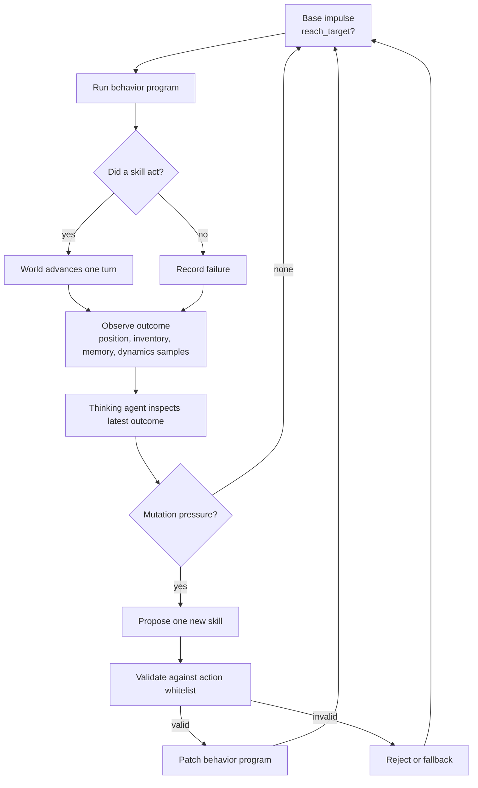

# Zima Blue Agent: Motivation And Framework

## Motivation

This project explores a small question: how little can an agent begin with and still become interesting?

Instead of starting with a powerful language model as the agent, the base actor is deliberately primitive. It has one fixed impulse: reach the target. It does not understand the world, plan deeply, or know which tools it will need. At the beginning, it can only run a tiny behavior program: notice if the target is underfoot, move east, and move south.

The point is not that this actor is smart. The point is that it can be placed inside a loop where failure becomes evidence, evidence creates mutation pressure, and mutation adds new capabilities around the same simple impulse.

The project is inspired by the feeling of progressive refinement in *Zima Blue*: a complex system repeatedly returns to a simple core. Here, the core is the base impulse. Everything else is acquired.

## Core Idea

The framework separates the agent into three layers:

1. **Base impulse**
   A tiny classifier-like policy emits `reach_target` until the target is reached, then emits `rest`.

2. **Behavior program**
   A mutable list of skills tries to satisfy that impulse. Skills may be primitive body actions, hand-written tools, or agent-written capabilities.

3. **Thinking/mutation loop**
   After each turn, a thinking agent inspects the latest outcome, failures, world memory, and dynamics evidence. It may add one new skill to the behavior program.

The important constraint is that new capabilities should not appear because the world hands the agent a labeled solution. They should appear because the agent has accumulated enough situated evidence.

For example, the world no longer says, "there is wind, use a controller." Instead, the agent tries to move through a region and records that intended moves do not match actual moves:

```text
from (5,3), intended (6,3), actual (5,4)
from (6,4), intended (7,4), actual (6,5)
```

Only after repeated mismatches can the thinking agent infer that the current movement model is wrong and add a learner such as `learner:fit-movement-model`, which trains a movement controller from scratch using the transition evidence.

## Heartbeat / Mutation Loop



## Example Capability Progression

```mermaid
sequenceDiagram
  participant Actor as Primitive Actor
  participant Program as Behavior Program
  participant World as World
  participant Thinker as Thinking Agent

  Actor->>Program: impulse = reach_target
  Program->>World: primitive moves
  World-->>Program: target not reached
  Thinker->>Program: add pathfinding

  Program->>World: pathfind to target
  World-->>Program: gate_locked
  Thinker->>Program: add key collection

  Program->>World: collect key, open gate
  World-->>Program: route continues

  Program->>World: intended move into unknown dynamics
  World-->>Program: actual move differs
  Program->>World: another attempted move
  World-->>Program: another mismatch sample
  Thinker->>Program: add movement learner

  Program->>World: use learned controller
  World-->>Actor: target reached
  Actor->>Program: impulse = rest
```

## Framework Components

- **Primitive actor**: emits only `reach_target` or `rest`.
- **World**: maintains state, blockers, inventory, target, and evidence such as locked-gate observations and movement samples.
- **Behavior program**: ordered skills; the first skill that succeeds acts for the turn.
- **Mutation pressure**: generated from actual failures and evidence, not from omniscient task labels.
- **Skill writer**: deterministic in the visual fallback, or LLM-backed through the agentic harness.
- **Validator/whitelist**: keeps model output inspectable by compiling JSON skill specs into known safe actions.

## Why This Is Interesting

The project is a toy environment for studying failure-driven capability acquisition. It makes the distinction between an agent that is given tools and an agent that earns tools through experience.

The current prototype shows:

- a fixed simple impulse can remain unchanged while competence expands around it
- locked doors can induce key/tool acquisition only after being encountered
- unknown dynamics can induce a learner only after intended-vs-actual mismatch evidence
- an LLM can participate as the mutation writer without being the base actor

## Research Direction

To become a publishable research artifact, the next step is to turn this into a benchmark-like loop:

- multiple worlds with hidden mechanics
- controlled comparisons against fixed planners, ReAct-style tool users, and non-mutating agents
- measurements of turns-to-solve, failed mutations, skill reuse, and generalization
- ablations for evidence quality, mutation frequency, and action whitelist size

The claim should stay modest: this is not open-ended self-improvement. It is a compact framework for studying how simple agents can acquire new capabilities from failure evidence while preserving a tiny base impulse.
