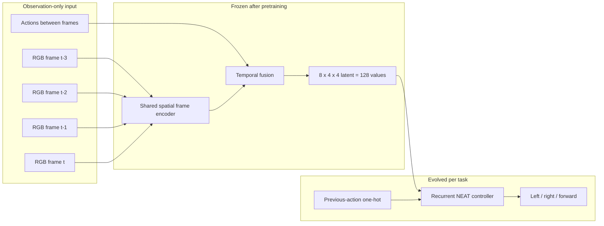
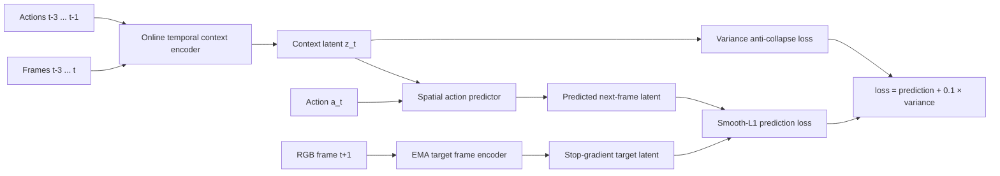
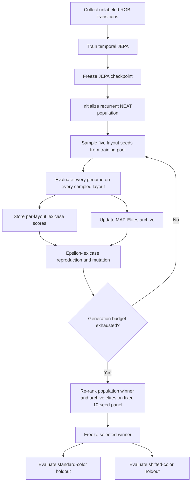
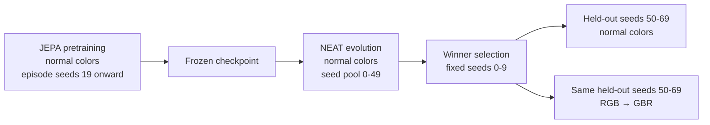
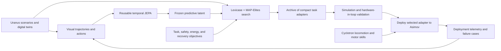

# Temporal JEPA + Neuroevolution for Visual Control

## Technical report and research proposal

**Status:** working research prototype

**Environment:** `MiniGrid-LavaCrossingS9N1-v0`

**Observation:** egocentric 7×7 partial view rendered as 56×56 RGB

**Last verified:** 2026-07-13

## Executive summary

This project tests a deliberately separated embodied-learning architecture:

1. A temporal Joint-Embedding Predictive Architecture (JEPA) learns a compact,
   action-conditioned representation from unlabeled visual transitions.
2. JEPA is frozen.
3. A small recurrent NEAT controller evolves over the frozen representation,
   using epsilon-lexicase selection and a MAP-Elites behavioral archive.

The central hypothesis is not that JEPA or neuroevolution is independently new.
It is that a reusable predictive representation may provide a stable substrate
on which small, deployment-specific controllers can be optimized with arbitrary
black-box objectives without backpropagating through perception.

The prototype provides evidence for one part of that hypothesis: across three
evolution seeds, trained temporal JEPA produced **8/60** standard-color held-out
successes while an architecture-matched random temporal encoder produced
**0/60**. The current system does not establish robust control: success remains
low, a sixfold larger NEAT search did not improve generalization, and an unseen
RGB channel remapping reduced temporal-JEPA performance to **2/60**.

The honest conclusion is therefore:

> Predictive representation learning contributes controller-useful structure,
> but the current temporal latent is neither sufficiently control-oriented nor
> appearance-invariant for reliable navigation.

## Research question

Can a frozen temporal predictive representation support small, topology-evolving
task adapters that:

- outperform controllers using an untrained representation;
- reuse the same perception model across tasks;
- optimize discrete, sparse, or non-differentiable deployment objectives;
- retain multiple useful behaviors rather than one scalar-fitness winner; and
- transfer across appearance, dynamics, and eventually morphology changes?

This repository currently addresses only the first item and an initial appearance
shift. The remaining items define the forward research program.

## System boundary

The temporal JEPA receives four consecutive egocentric RGB observations and the
three actions between them. It emits a normalized 8×4×4 spatial latent. Recurrent
NEAT receives the flattened 128-value latent plus an eight-value previous-action
one-hot vector and chooses a primitive action.



The controller does **not** receive:

- the complete MiniGrid environment;
- a persistent terrain map;
- symbolic object or terrain identifiers;
- absolute or environment-relative coordinates;
- reward, value, or Q predictions;
- an imagined route or planned action sequence; or
- hidden simulator state.

The earlier observation-only persistent map is retained only as a comparison and
visualization. It is not used by the RGB experiments.


## Temporal JEPA architecture

### Context encoder

Each 56×56 RGB frame passes through the same spatial encoder:

```text
3×56×56
  → Conv(3,16,k=5,s=2) + GELU
  → Conv(16,24,k=3,s=2) + GELU
  → Conv(24,24,k=3,s=1) + GELU
  → adaptive average pool to 4×4
  → 1×1 Conv(24,8)
  → normalized 8×4×4 frame latent
```

The four frame latents are concatenated in temporal order. Each of the three
previous actions is embedded into four values and broadcast over the 4×4 grid.
The resulting 44×4×4 tensor is fused by two spatial convolutions:

```text
(4 frames × 8 channels) + (3 actions × 4 channels)
  = 44×4×4
  → Conv(44,24,k=3) + GELU
  → Conv(24,8,k=3)
  → normalized 8×4×4 context latent
```

Temporal order is encoded by channel position. The model has no episode-length
recurrence and cannot accumulate a lifetime map.

### Predictor and target

The predictor receives the context latent and the action taken at time `t`. An
eight-value action embedding is broadcast over the latent grid, concatenated with
the context, and processed by a residual convolutional predictor.



Target-frame weights are an exponential moving average of the online frame encoder
with decay `0.995`. The baseline predicts the next single-frame latent. The improved
checkpoint rolls the same predictor through future actions and matches EMA target
latents at horizons 1, 2, and 4. Gradients update the context encoder, temporal
fusion, and predictor; they do not update the target encoder directly.

### Size and pretraining data

| Component | Trainable parameters |
|---|---:|
| Temporal context encoder | 21,400 |
| Action-conditioned predictor | 7,008 |
| Total | 28,408 |
| Controller-facing latent | 128 values |

The original temporal checkpoint used:

- 80 episodes;
- 2,525 observed transitions;
- 2,270 gradient updates;
- random navigation actions sampled with weights `left=1`, `right=1`,
  `forward=3`; and
- normal MiniGrid RGB colors only.

No task reward is used for JEPA pretraining.

The improved checkpoint keeps the same architecture and instead changes the data
and objective:

- 300 random episodes and 80/80 successful safe-planner trajectories;
- successful temporal sequences repeated five times in replay;
- 12,427 total four-frame training sequences;
- 3,000 gradient updates;
- prediction targets at horizons 1, 2, and 4; and
- per-pixel channel sorting before encoding, making the representation invariant
  to any RGB channel permutation by construction.

The safe planner is used only to collect successful RGB/action trajectories. No
planner map, goal coordinate, symbolic terrain, or privileged state enters JEPA.

## Freezing and controller evolution

After pretraining, all JEPA parameters are placed in evaluation mode and remain
frozen throughout evolution. Exact temporal contexts are cached to avoid repeated
encoder inference.



### Controller interface

| Input or output | Size |
|---|---:|
| Temporal JEPA latent | 128 |
| Previous-action one-hot, including unknown | 8 |
| Total NEAT inputs | 136 |
| NEAT outputs | 7 |
| Enabled LavaCrossing actions | 3: left, right, forward |

The network is recurrent (`feed_forward = False`). A typical selected winner has
seven or eight non-input nodes and approximately 240–246 enabled or disabled
connection genes. The exact active phenotype should be inspected separately from
the serialized genome count.

### Fitness and selection

Episode fitness contains:

- `+10.0` for reaching the goal;
- `-1.0` for terminal failure;
- `+0.005` for a new RGB observation;
- `+0.01` for a new dead-reckoned position;
- `-0.01` for a blocked forward step; and
- `-0.001` per environment step.

The aggregate across sampled layouts combines mean fitness, 25% of worst-layout
fitness, and twice the success rate. Epsilon-lexicase reproduction retains genomes
that are competitive on individual layout cases rather than only average fitness.

MAP-Elites archives behavior by task progress, solves, exploration coverage, and
low-blockage behavior. The general archive also contains key-collection and
door-opening dimensions; those dimensions are always zero for LavaCrossing.

Position shaping uses dead reckoning and treats an identical RGB observation after
`forward` as blocked. Visual aliasing can therefore make the estimated position
incorrect. This is observable shaping rather than hidden-map leakage, but it is a
known confound that should be removed or separately ablated in publication-quality
experiments.

## Experimental design

### Controls

The main experiment compares:

1. **Downsampled RGB:** 8×8×3 block-averaged pixels, or 192 values.
2. **Random spatial encoder:** identical one-frame architecture, untrained and frozen.
3. **Trained spatial JEPA:** one-frame predictive encoder.
4. **Random temporal encoder:** identical four-frame temporal architecture,
   untrained and frozen.
5. **Trained temporal JEPA:** the proposed representation.

All controller arms use recurrent NEAT. Temporal trained/random arms have the same
128-value visual interface and the same controller input count.

### Data separation



The appearance test cyclically maps every pixel from `[R,G,B]` to `[G,B,R]` at
the observation boundary. Geometry, environment state, actions, layout seeds, and
episode limits remain unchanged. JEPA and NEAT receive no training or adaptation
on the changed palette.

## Results

### One-frame comparison, seed 19

Budget: 20 generations × 30 genomes, five randomly sampled layouts per generation.

| Controller input | Fixed training panel | Standard held-out |
|---|---:|---:|
| Downsampled RGB | 2/10 | 2/20 |
| Random spatial encoder | 0/10 | 0/20 |
| Trained spatial JEPA | 2/10 | 2/20 |

Predictive training improved over the architecture-matched random encoder but did
not outperform direct pixels.

### Temporal comparison across evolution seeds

Budget per run: 20 generations × 30 genomes.

| Representation | Evolution seed | Training | Standard held-out | RGB→GBR held-out |
|---|---:|---:|---:|---:|
| Temporal JEPA | 19 | 2/10 | 2/20 | 0/20 |
| Temporal JEPA | 29 | 3/10 | 3/20 | 0/20 |
| Temporal JEPA | 39 | 3/10 | 3/20 | 2/20 |
| **Temporal JEPA total** | **3 runs** | **8/30** | **8/60** | **2/60** |
| Temporal random | 19 | 0/10 | 0/20 | 0/20 |
| Temporal random | 29 | 0/10 | 0/20 | 0/20 |
| Temporal random | 39 | 1/10 | 0/20 | 0/20 |
| **Temporal random total** | **3 runs** | **1/30** | **0/60** | **0/60** |

For seed 19, the successful temporal-JEPA standard-color routes averaged 13 steps,
versus 19 for one-frame JEPA and 15 for downsampled RGB. With only two successful
episodes per condition, this is descriptive rather than statistically persuasive.

### Expanded NEAT budget

To test controller-search underfitting, temporal-JEPA seed 19 was expanded from
20×30 to 60 generations × 60 genomes. JEPA remained frozen and the fitness was
unchanged.

| Budget | Approx. evolutionary episodes | Training | Standard held-out | RGB→GBR held-out |
|---|---:|---:|---:|---:|
| 20×30 | 3,000 | 2/10 | 2/20 | 0/20 |
| 60×60 | 18,000 | 3/10 | 1/20 | 0/20 |

Six times more search added one fixed-panel training success and reduced held-out
success. Insufficient search is therefore not the sole or primary explanation of
the current performance ceiling.

### Improved pretraining and color transfer

The improved temporal JEPA was evaluated with the original matched seed-19
controller budget: 20 generations × 30 genomes. The color-canonical representation
reduced standard-versus-cyclic latent L2 displacement to numerical noise
(`3.55×10^-7` mean after training).

| Checkpoint | Training | Standard held-out | RGB→GBR held-out | Mean solved steps |
|---|---:|---:|---:|---:|
| Original temporal JEPA | 2/10 | 2/20 | 0/20 | 13 standard |
| Improved temporal JEPA | 2/10 | 2/20 | 2/20 | 13 in both palettes |

The improvement fixed the measured channel-permutation transfer failure but did
not increase navigation success. Channel sorting guarantees invariance only to
channel permutations; it does not guarantee robustness to arbitrary hue, lighting,
texture, camera, or geometry shifts.

A synchronized video shows the same frozen policy independently succeeding on
held-out seed 52 under standard RGB and cyclic `RGB→GBR`:

<../artifacts/jepa/temporal-jepa-color-success-seed52.mp4>

### Bottleneck ablation: observation, memory, or search?

Three seed-19 diagnostics held the improved JEPA, fitness, randomized training
pool, lexicase selection, MAP-Elites archive, and 20-seed holdout fixed.

| Condition | Generations × population | Training | Held-out | Mean solved steps |
|---|---:|---:|---:|---:|
| Recurrent baseline | 20 × 30 | 2/10 | 2/20 | 13.0 |
| Feed-forward controller | 20 × 30 | 2/10 | 1/20 | 16.0 |
| Recurrent, 3.3× search | 40 × 50 | 2/10 | 2/20 | 13.0 |
| Recurrent + oracle next-safe-action hint | 20 × 30 | 10/10 | 20/20 | 49.9 |

The feed-forward ablation removes NEAT's recurrent state while retaining the
four-frame JEPA context. Its one-success decrease indicates that recurrence helps,
but does not explain most failures. Increasing genome-generations from 600 to
2,000 produced no held-out improvement, so this search expansion did not address
the ceiling.

The oracle condition appends a three-value one-hot hint computed by a full-state
shortest-safe-path planner at every step. This is intentionally much stronger than
showing the controller a full-grid image. It is not a deployable method or evidence
that full-grid pixels would yield 20/20. It is a diagnostic upper bound: at the
matched search budget, NEAT can evolve a controller that generalizes across every
held-out layout when route-relevant state is explicit. The primary observed gap is
therefore constructing and retaining route-relevant belief state from partial
observations, rather than controller size or this range of evolutionary compute.

### Learned recurrent belief head

The first oracle-replacement experiment freezes the improved temporal JEPA and
trains a separate 64-state GRU belief decoder. Full simulator state is used only to
form pretraining labels. At control time the GRU receives the 128-value JEPA latent
and previous action; it never receives the map, pose, goal coordinate, planner, or
teacher targets.

The supervised targets are:

- shortest-safe next-action distribution;
- immediate left/right/forward collision risk;
- normalized safe-path distance, egocentric goal offset, and recent progress; and
- a barrier-crossing event plus persistent opposite-side belief.

The belief head has 39,564 parameters and exports its 64 recurrent values plus 12
decoded values, giving NEAT 212 inputs in total. On validation layouts 40–49 it
reached 43.8% route-action accuracy, 98.8% collision accuracy, 0.127 goal-feature
MAE, and 92.6% barrier accuracy. Both JEPA and belief weights were then frozen.

| Frozen controller substrate | Training | Held-out standard | Held-out RGB→GBR |
|---|---:|---:|---:|
| Temporal JEPA | 2/10 | 2/20 | 2/20 |
| Temporal JEPA + deterministic belief v1 | 3/10 | **3/20** | **3/20** |
| Temporal JEPA + uncertainty-aware belief v2 | 2/10 | 2/20 | 2/20 |
| Belief v2 + active-information lexicase | 3/10 | **3/20** | **3/20** |
| Temporal JEPA + full-state action oracle | 10/10 | 20/20 | not evaluated |

The learned belief improves success only modestly. Exact shortest-route action is
not always identifiable before the gap or goal has entered the observation
history, so treating it as an ordinary deterministic target creates irreducible
label ambiguity. Collision and barrier memory transfer well; route inference does
not. The next version should predict uncertainty-aware traversability and
information-gathering value rather than distilling a hidden-state planner action.
This module is supervised belief-state distillation on top of JEPA, not a pure JEPA
objective, and should be described as such.

Belief v2 replaces the single planner-action label with a safe-route distribution
mixed according to unobserved coverage. It also predicts information gained by the
action actually taken and the fraction of the grid observed so far. On validation,
exploration/coverage MAE was 0.048 while collision and barrier accuracy remained
98.8% and 92.5%. Exact route accuracy fell to 38.4%, as expected for a soft target.

Despite exposing uncertainty, v2 returned to 2/20 held-out successes. Mean unique
observations rose from 7.2 for JEPA-only to 8.2, but remained below v1's 12.7. The
current evolutionary objective rewards movement novelty and goal completion, not
uncertainty reduction itself. Providing an information-gain estimate therefore does
not ensure that NEAT will choose information-gathering actions. This is a negative
result: uncertainty-aware features alone are insufficient without a controller
objective or learning rule that values active information gathering.

An active-information epsilon-lexicase condition adds simultaneous per-layout
cases for task fitness, entropy reduction multiplied by confirmed coverage,
confirmed observations/positions, and safe exploration. It is not a staged
curriculum: case order is randomized for every parent selection, and final winner
selection still uses ordinary aggregate task fitness. At the same 20×30 budget it
recovers 3/20 in both palettes. Mean confirmed observations increase from 8.2 for
ordinary v2 to 9.4, while mean cumulative route-entropy reduction changes only from
0.513 to 0.527. Active selection helps recover one success, but does not outperform
deterministic belief v1, which reaches 12.7 mean observations and 3/20.

### Evolution-seed replication

The v1, ordinary-v2, and active-v2 conditions were repeated with evolution seeds
19, 29, and 39. Every run used the same 20-generation, population-30 budget,
training-layout pool 0-49, five sampled layouts per generation, and held-out
layouts 50-69.

| Evolution seed | Deterministic v1 | Ordinary v2 | Active v2 |
|---:|---:|---:|---:|
| 19 | 3/20 | 2/20 | 3/20 |
| 29 | 3/20 | 3/20 | 3/20 |
| 39 | 3/20 | 3/20 | 3/20 |
| **Total** | **9/60** | **8/60** | **9/60** |

Mean unique observations across the three runs were 17.17 for v1, 10.40 for
ordinary v2, and 15.78 for active v2; mean unique positions were 8.67, 7.80, and
8.55 respectively. Thus, the original 2/20-to-3/20 active-v2 improvement does not
replicate as an advantage over v1. Active selection remains competitive and often
changes behavior, but neither success nor exploration improves consistently across
evolution seeds. With only 60 episodes per condition and highly correlated fixed
hold-out layouts, these totals are descriptive rather than a significance claim.
Every 3/20 winner solved the same held-out layouts: seeds 52, 60, and 65. Ordinary
v2 at evolution seed 19 instead solved seeds 53 and 59. The repeated 3/20 result is
therefore a stable competence boundary on a particular layout subset, not evidence
that different evolutionary runs discover complementary solutions.

### Tiny-recursive belief pilot

A TRM-inspired continuous belief head was tested between the frozen temporal JEPA
and recurrent NEAT. This is not a direct reproduction of the discrete puzzle TRM:
MiniGrid is online and partially observed, so the head carries a persistent
64-value answer state and 64-value scratch state between environment steps. Inside
each step, one shared two-layer refiner repeatedly updates both states from the
current 128-value JEPA latent and previous action. The final answer state is decoded
into the same route, collision, goal, barrier, and exploration targets as belief v2.
Intermediate refinements receive auxiliary supervision during training.

The recursive head has 41,264 parameters, versus 39,824 for uncertainty-aware GRU
belief v2. Depth 1 and depth 6 use exactly the same architecture and parameter
count; only repeated computation changes. Both were trained for 600 updates on the
same 280 training and 60 validation episodes.

| Belief decoder | Refinements | Validation route accuracy | Collision accuracy | Goal MAE | Exploration MAE |
|---|---:|---:|---:|---:|---:|
| GRU belief v2, 1,500 updates | 1 recurrent update | 38.4% | 98.8% | 0.122 | 0.048 |
| Tiny-recursive | 1 | 38.7% | 98.8% | 0.130 | 0.077 |
| Tiny-recursive | 6 | **40.7%** | 98.8% | 0.137 | 0.094 |

The two recursive checkpoints were then given identical seed-19 NEAT searches at
20 generations by 30 genomes.

| Recursive depth | Training layouts | Held-out standard | Held-out cyclic RGB | Mean observations | Mean positions |
|---:|---:|---:|---:|---:|---:|
| 1 | 3/10 | 3/20 | 3/20 | 10.8 | 7.80 |
| 6 | 3/10 | 3/20 | 3/20 | 11.6 | 8.15 |

Both controllers solved exactly layouts 52, 60, and 65 in 18 mean steps. Sixfold
refinement modestly improves route-label accuracy and exploration, but does not
expand held-out control competence and incurs substantial CPU inference cost. This
single-evolution-seed pilot supports architectural compatibility between JEPA and
recursive belief refinement; it does not support a control advantage. Because the
GRU used more training updates, its validation row is contextual rather than a
strict compute-matched baseline.

### Learned evidence-map pilot

The next pilot removes planner-action and hidden-route targets. A 28,774-parameter
spatial head decodes only view-aligned terrain evidence from the frozen 128-value
JEPA latent: unseen, free, wall, lava, and goal. A second head predicts whether the
preceding forward command actually moved the agent. At inference, these predictions
and known left/right action semantics update a start-relative terrain map. No
simulator pose, map, collision flag, planner, or hidden cell is exposed.

The controller receives 25 derived queries: immediate action-relative safety,
lava/wall/unknown evidence, visit evidence, map coverage and confidence, learned
motion evidence, and relative observed goal/frontier direction. It also retains the
original JEPA latent and previous-action input.

Rare evidence exposed a calibration tradeoff on validation layouts 40-49:

| Evidence training | Visible accuracy | Lava precision / recall / F1 | Goal precision / recall / F1 | Wall recall | Motion accuracy |
|---|---:|---:|---:|---:|---:|
| Unbalanced | 82.8% | not recorded / 55.7% / not recorded | not recorded / 17.0% / not recorded | 99.7% | 100% |
| Rare-frame balanced, high recall | 75.4% | 22.0% / 72.9% / 33.6% | 14.4% / 66.2% / 23.6% | 99.3% | 100% |
| Rare-frame balanced, lower weights | 89.9% | 33.2% / 14.4% / 19.9% | 21.4% / 11.9% / 15.2% | 99.4% | 100% |

The high-recall checkpoint was selected because missed lava cannot contribute to
avoidance, while repeated observations could in principle average false evidence.
With the same seed-19 20-generation by 30-genome NEAT budget, it solved 2/10 final
training layouts and only 1/20 held-out layouts in both standard and cyclic RGB.
The lone held-out success was layout 53 and required 175 steps. Mean unique
observations increased to 14.05, but mean unique positions fell to 7.35.

This is a negative result for the current accumulator, not for evidence-based
belief generally. The head learns walls and observable motion very reliably, but
class-weighted rare predictions are not calibrated. Because evidence is persistent,
even infrequent false lava or goal claims become durable map errors. The next
implementation should calibrate per-class likelihood ratios on validation data,
retain explicit unknown mass, and decay or revise conflicting evidence before
adding pose hypotheses or recursive refinement.

#### Calibrated likelihood-ratio revision

The follow-up retains the high-recall terrain decoder but calibrates its outputs on
half of the unseen validation samples using one scalar temperature and five
per-class biases. The remaining validation samples are kept as an audit split. The
map no longer sums class probabilities. It divides calibrated terrain posteriors by
their empirical class priors, accumulates bounded log-likelihood ratios, tracks
evidence strength separately as explicit unknown mass, and discounts an old claim
whenever the cell is re-observed so contradictory evidence can revise it.

| Audit metric | Raw weighted decoder | Calibrated decoder |
|---|---:|---:|
| Multiclass NLL | 0.245 | **0.130** |
| Brier score | 0.162 | **0.075** |
| Visible terrain accuracy | 75.9% | **91.1%** |
| Lava precision | 22.0% | **43.2%** |
| Goal precision | 13.7% | **31.7%** |
| Motion accuracy | 100% | 100% |

Argmax lava and goal recall fall after calibration, but map integration consumes
continuous likelihood ratios rather than hard classifications. Consistent weak
evidence can therefore accumulate without treating every rare-class argmax as a
durable fact.

At the same seed-19 20-generation by 30-genome controller budget, calibrated
revision improves final training success from 2/10 to 3/10 and held-out success
from 1/20 to **3/20**. It remains 3/20 under cyclic RGB. Mean observations rise
from 14.05 to 16.05 and mean positions from 7.35 to 7.95; successful episodes
average 66 steps rather than 175. This validates calibration and revisable evidence
as necessary components. However, the successful layouts are again exactly seeds
52, 60, and 65, so the method restores the established competence boundary rather
than extending it.

## Interpretation

### Supported by the evidence

- Temporal predictive training changes the representation in a way that recurrent
  neuroevolution can exploit; the trained encoder consistently outperforms its
  exact random-architecture control.
- A small frozen predictive representation can support some held-out visual control
  without a symbolic map.
- Additional NEAT compute alone does not resolve the low success rate.
- Explicit full-state route advice raises the matched controller from 2/20 to
  20/20, localizing the main gap to route-relevant state estimation or memory.
- Appearance invariance does not emerge automatically from single-palette temporal
  prediction.

### Not supported by the evidence

- The system does not solve MiniGrid reliably.
- Temporal JEPA has not outperformed downsampled RGB on success rate.
- The representation is not invariant to arbitrary palette, lighting, texture,
  camera, or geometry changes; only RGB channel permutations are guaranteed.
- No sim-to-real or robotics transfer has been demonstrated.
- No sample-efficiency or compute advantage over PPO, SAC, Dreamer, an MLP/GRU
  controller, or model-predictive control has been demonstrated.
- The current results do not justify claiming a new general world-model algorithm.

## Novelty and prior art

The ingredients have substantial precedent:

- Ha and Schmidhuber's *World Models* learns a compact visual dynamics model and
  optimizes a small controller with evolutionary methods:
  <https://arxiv.org/abs/1803.10122>
- Risi and Stanley evolve recurrent and discrete world-model systems:
  <https://arxiv.org/abs/1906.08857>
- V-JEPA 2-AC demonstrates action-conditioned latent prediction and robotic planning:
  <https://arxiv.org/abs/2506.09985>

The potentially publishable contribution is narrower:

> Frozen temporal joint-embedding prediction as a reusable perceptual substrate
> for quality-diversity evolution of compact recurrent task adapters under
> deployment shift.

That claim requires stronger evidence than MiniGrid alone. In particular, novelty
must come from demonstrated properties—reuse, adaptation efficiency, diversity,
safety-objective compatibility, or transfer—not merely from combining JEPA, NEAT,
lexicase, and MAP-Elites.

## Menlo Research relevance

Menlo describes a deployment loop spanning its Uranus world simulator, Cyclotron
motor-control pipeline, Asimov reference humanoid, and telemetry-driven Data Engine:
<https://www.menlo.ai/handbook/solution>.

The appropriate integration hypothesis is:



This should be pitched as a possible **high-level adaptation, skill-selection, or
failure-recovery layer**, not as a replacement for Cyclotron's locomotion or
torque-level reinforcement learning.

### Proposed first collaboration experiment

Select one narrow Uranus scenario with an existing policy baseline and a discrete
or moderately sized action/skill interface. Compare:

1. frozen temporal JEPA + recurrent NEAT/MAP-Elites;
2. frozen temporal JEPA + gradient-trained MLP or GRU;
3. raw observations + recurrent NEAT;
4. random frozen encoder + recurrent NEAT; and
5. Menlo's existing policy.

Evaluate:

- task success on training and untouched scenario families;
- simulator episodes and wall-clock compute;
- controller parameter count and inference latency;
- recovery after injected failures;
- diversity and usefulness of archived behaviors;
- transfer under texture, lighting, camera, dynamics, payload, and morphology
  randomization; and
- any hardware-in-loop regressions before physical deployment.

The experiment should remain in simulation until the proposed method matches a
conventional controller on standard scenarios and demonstrates a specific advantage
under black-box constraints or distribution shift.

## Next experiments

Priority order:

1. **Audit map alignment and add pose hypotheses.** Calibration repairs the
   evidence collapse, but success remains limited to the same layouts. Measure
   cell-level accumulated-map accuracy over time, then replace the single
   dead-reckoned pose with a small distribution over competing poses.
2. **Control-oriented representation diagnostics.** Measure whether latent distance
   correlates with action reachability, collision risk, and goal progress rather than
   only next-frame prediction error.
3. **Stronger learned memory baseline.** Compare recurrent NEAT with a small GRU or
   state-space controller trained on the same frozen JEPA sequence.
4. **Shuffled-context ablation.** Shuffle frame or action order at evaluation to verify
   that the controller uses temporal structure rather than static appearance alone.
5. **Gradient-trained controller baseline.** Compare the frozen latent with MLP, GRU,
   PPO/SAC, and a small planning/value head under matched environment interaction.
6. **Broader appearance invariance.** Extend beyond the now-solved channel-permutation
   case to lighting, hue, texture, and camera perturbations.
7. **Remove position shaping.** Evaluate with success, observation novelty, and blocked
   penalties only, or replace dead reckoning with a separately audited observable
   odometry signal.
8. **Cross-task reuse.** Freeze one JEPA across several LavaCrossing families and other
   visual navigation tasks while evolving separate small adapters.
9. **Archive evaluation.** Test whether MAP-Elites contains meaningfully different
   recovery or risk profiles, rather than merely redundant low-fitness policies.

## Repository map

| Path | Purpose |
|---|---|
| `zima_py/rgb_jepa.py` | Spatial and temporal RGB encoders, predictors, replay, training, checkpoints |
| `zima_py/train_rgb_jepa.py` | One-frame spatial-JEPA pretraining |
| `zima_py/train_temporal_rgb_jepa.py` | Four-frame temporal-JEPA pretraining |
| `zima_py/jepa_belief.py` | Frozen-JEPA recurrent belief decoder and checkpoint format |
| `zima_py/train_jepa_belief.py` | Privileged-label belief pretraining; partial RGB at inference |
| `zima_py/evolve_rgb_neat.py` | RGB controls, recurrent NEAT, lexicase, MAP-Elites, paired color evaluation |
| `zima_py/evaluate_rgb_neat.py` | Paired evaluation of a frozen winner under standard and shifted RGB |
| `zima_py/visualize_rgb_terrain.py` | Current RGB versus earlier persistent-map visualization |
| `zima_py/visualize_color_success.py` | Paired successful standard/cyclic replay video |
| `test/test_rgb_jepa.py` | Shape, training, checkpoint, temporal-context, and color-shift tests |
| `artifacts/jepa/` | Checkpoints, winners, and JSON experiment reports |

## Reproduction

Install dependencies:

```bash
uv sync
```

Train the temporal JEPA:

```bash
uv run zima-temporal-rgb-jepa-train \
  --env MiniGrid-LavaCrossingS9N1-v0 \
  --episodes 300 --expert-episodes 80 --expert-repeat 5 \
  --updates 3000 --max-steps 96 \
  --horizon 1 --horizon 2 --horizon 4 \
  --checkpoint artifacts/jepa/temporal-rgb-s9n1-improved.pt \
  --report artifacts/jepa/temporal-rgb-s9n1-improved-training.json
```

Train the recurrent belief decoder and evolve a controller with both modules
frozen:

```bash
uv run zima-jepa-belief-train
uv run zima-rgb-neat \
  --input-mode temporal-jepa --seed 19 \
  --checkpoint artifacts/jepa/temporal-rgb-s9n1-improved.pt \
  --belief-checkpoint artifacts/jepa/temporal-rgb-s9n1-belief.pt \
  --generations 20 --population 30
```

Evolve a trained temporal-JEPA controller and run paired color holdouts:

```bash
uv run zima-rgb-neat \
  --input-mode temporal-jepa --seed 29 \
  --generations 20 --population 30 \
  --training-seed-pool 50 --cases-per-generation 5 \
  --holdout-start 50 --holdout-count 20 \
  --checkpoint artifacts/jepa/temporal-rgb-s9n1-fresh.pt \
  --holdout-rgb-style cyclic \
  --report artifacts/jepa/temporal-jepa-seed29-color-report.json \
  --winner artifacts/jepa/temporal-jepa-seed29-winner.pkl --quiet
```

Run the architecture-matched random control:

```bash
uv run zima-rgb-neat \
  --input-mode temporal-random --seed 29 \
  --generations 20 --population 30 \
  --training-seed-pool 50 --cases-per-generation 5 \
  --holdout-start 50 --holdout-count 20 \
  --holdout-rgb-style cyclic \
  --report artifacts/jepa/temporal-random-seed29-color-report.json \
  --winner artifacts/jepa/temporal-random-seed29-winner.pkl --quiet
```

Evaluate one saved winner on both appearances without evolution:

```bash
uv run zima-rgb-neat-eval \
  --input-mode temporal-jepa --seed 19 \
  --winner artifacts/jepa/temporal-full-jepa-winner.pkl \
  --checkpoint artifacts/jepa/temporal-rgb-s9n1-fresh.pt \
  --report artifacts/jepa/temporal-jepa-seed19-color-eval.json
```

Render the paired successful color replay:

```bash
uv run zima-rgb-color-video \
  --seed 52 \
  --winner artifacts/jepa/temporal-jepa-seed39-winner.pkl \
  --checkpoint artifacts/jepa/temporal-rgb-s9n1-fresh.pt \
  --output artifacts/jepa/temporal-jepa-color-success-seed52.mp4
```

Run verification:

```bash
uv run python -m unittest discover -s test -p "test_*.py" -v
npm test
```

## Artifact index

Primary evidence files:

- `artifacts/jepa/temporal-rgb-s9n1-fresh-training.json`
- `artifacts/jepa/temporal-rgb-s9n1-improved-training.json`
- `artifacts/jepa/temporal-improved-neat-seed19-report.json`
- `artifacts/jepa/temporal-rgb-s9n1-belief-training.json`
- `artifacts/jepa/temporal-belief-neat-seed19-report.json`
- `artifacts/jepa/temporal-belief-neat-seed19-color-report.json`
- `artifacts/jepa/temporal-rgb-s9n1-belief-v2-training.json`
- `artifacts/jepa/temporal-belief-v2-neat-seed19-report.json`
- `artifacts/jepa/temporal-belief-v2-neat-seed19-color-report.json`
- `artifacts/jepa/temporal-belief-v2-active-neat-seed19-report.json`
- `artifacts/jepa/temporal-belief-v2-active-neat-seed19-color-report.json`
- `artifacts/jepa/temporal-jepa-color-success-seed52.mp4`
- `artifacts/jepa/temporal-full-jepa-report.json`
- `artifacts/jepa/temporal-full-random-report.json`
- `artifacts/jepa/temporal-jepa-seed19-color-eval.json`
- `artifacts/jepa/temporal-random-seed19-color-eval.json`
- `artifacts/jepa/temporal-jepa-seed29-color-report.json`
- `artifacts/jepa/temporal-jepa-seed39-color-report.json`
- `artifacts/jepa/temporal-random-seed29-color-report.json`
- `artifacts/jepa/temporal-random-seed39-color-report.json`
- `artifacts/jepa/temporal-jepa-seed19-expanded-color-report.json`
- `artifacts/jepa/rgb-full-raw-report.json`
- `artifacts/jepa/rgb-full-random-report.json`
- `artifacts/jepa/rgb-full-jepa-report.json`

## Current claim

The strongest defensible claim from this repository is:

> In a partially observed visual navigation benchmark, a small temporal
> action-conditioned JEPA produced a frozen representation that recurrent
> quality-diversity neuroevolution could exploit, while an architecture-matched
> random encoder produced no held-out successes across three evolution seeds.
> The baseline degraded substantially under an unseen color transformation. An
> improved, channel-canonical multi-horizon checkpoint eliminated that specific
> transfer gap at matched controller budget. Feed-forward and expanded-search
> ablations remained at 1/20 and 2/20, while explicit full-state route advice
> reached 20/20. A learned recurrent belief decoder improved matched held-out
> success to 3/20 without inference-time simulator state, but ambiguous route
> prediction remained weak. An uncertainty-aware second version returned to 2/20,
> while simultaneous active-information lexicase recovered 3/20. This does not yet
> outperform deterministic belief v1, but it shows that controller selection affects
> whether uncertainty-aware features are used. The main observed bottleneck remains
> active belief construction and information-gathering control.

Anything stronger requires broader environments, conventional learning baselines,
and eventually simulator or robot validation.
